# Kinematic Analysis

Run the forward_kinematics demo and evaluate the kr210.urdf.xacro file to perform kinematic analysis of Kuka KR210 robot and derive its DH parameters.

Your writeup should contain a DH parameter table with proper notations and description about how you obtained the table. Make sure to use the modified DH parameters discussed in this lesson. Please add an annotated figure of the robot with proper link assignments and joint rotations (Example figure provided in the writeup template). It is strongly recommended that you use pen and paper to create this figure to get a better understanding of the robot kinematics.
___
The KUKA KR210 has 6 revolute joints. Below are the simulated arm's labelled joints. 

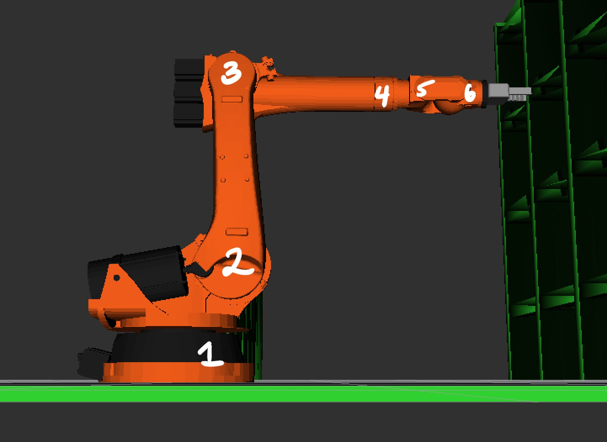

The figure drawn below shows the joint assignments (black), joint axes and positive z-axes (yellow), positive x-axes (green), and joint rotations about z (blue). The joint rotations are variable since these are revolute joints. To follow convention, the joint rotations are all shown as 0 here with the exception of joint 2 which has a -90 degree offset. The diagram also labels certain link lengths and offsets, which are further explained later on.

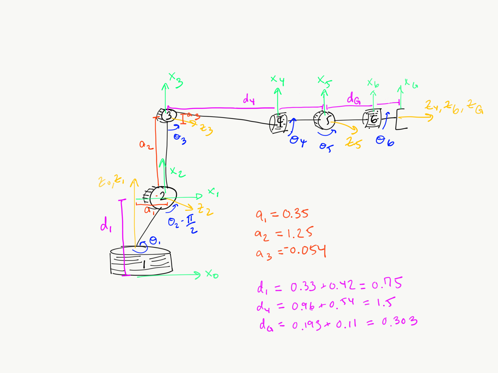

Using this figure, the following DH Parameter Table was derived.

i | Links | alpha(i-1) | a(i-1) | d(i) | theta(i)
--- | --- | --- | --- | --- | ---
1   | 0->1  | 0     | 0  | d1 | q1
2   | 1->2  | -pi/2 | a1 | 0  | -pi/2 + q2
3   | 2->3  | 0     | a2 | 0  | q3
4   | 3->4  | -pi/2 | a3 | d4 | q4
5   | 4->5  | pi/2  | 0  | 0  | q5
6   | 5->6  | -pi/2 | 0  | 0  | q6
7   | 6->EE | 0     | 0  | d7 | 0

**alpha(i-1)** is the twist angle from z(i-1) to z(i) about x(i-1) in a right hand sense
- for coincident or parallel z-axes such as 0->1, 2->3, and 6->EE the twist angle is 0

**a(i-1)** is the link length from z(i-1) to z(i) measured along x(i-1) where x(i-1) is perpendicular to z(i-1) and z(i)
- only links 1->2, 2->3, and 3->4 had any link length

**d(i)** is the link offset measured from x(i-1) to x(i) measured along z(i)
- only links 0->1, 3->4, and 6->EE had a link offset

**theta(i)** is the joint angle between x(i-1) and x(i) about z(i) in a right hand sense
- these are the joint parameters we'd like to solve for (inverse kinematics)
- currently, the arm is shown in its initial state where the joint angles aside from joint 2 are 0

The values for a(i-1) and d(i) were found by referring to the table below showing the frame references for the urdf file from lecture and cross-referencing that with the figure drawn above.

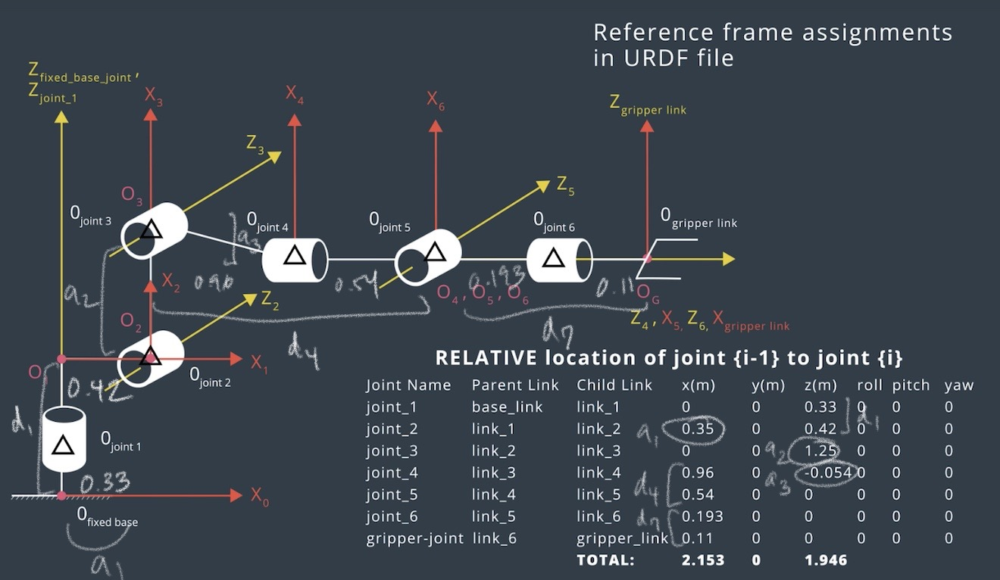

a | value
---  | ---
a1   | 0.35  
a2   | 1.25  
a3   | -0.054

d | value
--- | ---
d1   | 0.75  = 0.33 + 0.42
d4   | 1.5   = 0.96 + 0.54
d7   | 0.303 = 0.193 + 0.11
___
Using the DH parameter table you derived earlier, create individual transformation matrices about each joint. In addition, also generate a generalized homogeneous transform between base_link and gripper_link using only end-effector(gripper) pose.

Your writeup should contain individual transform matrices about each joint using the DH table and a homogeneous transform matrix from base_link to gripper_link using only the position and orientation of the gripper_link. These matrices can be created using any software of your choice or hand written. Also include an explanation on how you created these matrices.
___
To create transformation matrices for each joint (or from link i-1 to i), the following equation can be used where `c` is for `cos` and `s` is for `sin`:

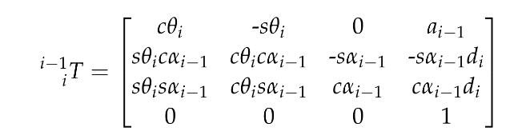

In my code, the `TF_Matrix()` function does this calculation, substituting in values from the DH table. I can then compose these individual transformations, `T0_1`, ..., `T6_EE` to get the transformation matrix from the base link to the end effector, `T0_EE`.
```
    # define function for transformation from link i-1 to i
    def TF_Matrix(alpha, a, d, q):
      TF = Matrix([[            cos(q),           -sin(q),           0,             a],
                   [ sin(q)*cos(alpha), cos(q)*cos(alpha), -sin(alpha), -sin(alpha)*d],
                   [ sin(q)*sin(alpha), cos(q)*sin(alpha),  cos(alpha),  cos(alpha)*d],
                   [                 0,                 0,          0,             1]])
      return TF

    # individual transformation matrix from link i-1 to i
    T0_1 = TF_Matrix(alpha0, a0, d1, q1).subs(DH_Table)
    T1_2 = TF_Matrix(alpha1, a1, d2, q2).subs(DH_Table)
    T2_3 = TF_Matrix(alpha2, a2, d3, q3).subs(DH_Table)
    T3_4 = TF_Matrix(alpha3, a3, d4, q4).subs(DH_Table)
    T4_5 = TF_Matrix(alpha4, a4, d5, q5).subs(DH_Table)
    T5_6 = TF_Matrix(alpha5, a5, d6, q6).subs(DH_Table)
    T6_EE = TF_Matrix(alpha6, a6, d7, q7).subs(DH_Table)
```

The individual transformations can be combined into the complete homogeneous transform.
```
    # total transformation matrix from link 0 to the end effector
    T0_EE = T0_1 * T1_2 * T2_3 * T3_4 * T4_5 * T5_6 * T6_EE
```

The following joint angles for theta1-6 are used to check this FK solution: `[-0.65,0.45,-0.36,0.95,0.79,0.49]`. The position of the end effector is `[FK[0,3],FK[1,3],FK[2,3]]` from `FK = T0_EE.evalf(subs={q1: theta1, q2: theta2, q3: theta3, q4: theta4, q5: theta5, q6: theta6})`. 

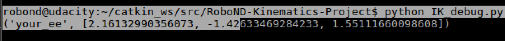

One can check this example using the `roslaunch kuka_arm forward_kinematics.launch` command and either the `rosrun tf tf_echo base_link gripper_link` command or looking at RViz.

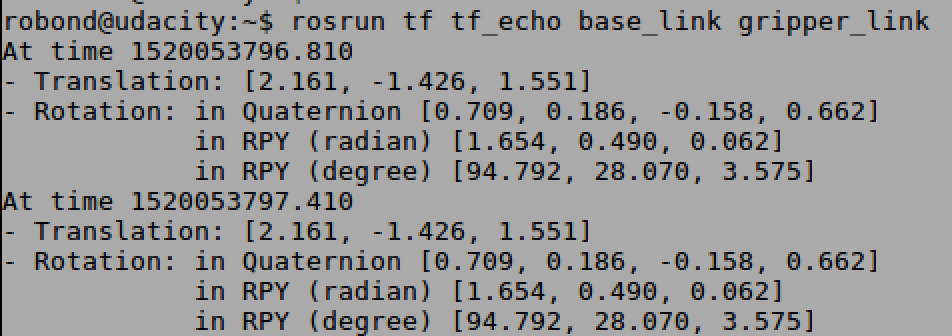
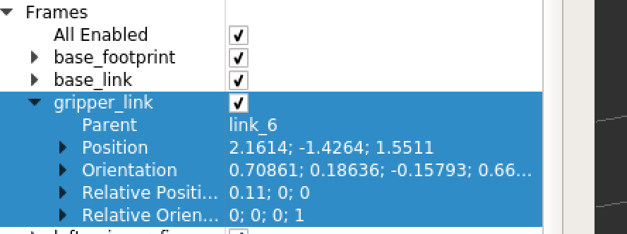

These match up nicely.

For a generalized homogeneous transform between base_link and gripper_link using only end-effector(gripper) pose, one starts with the position and orientation (rotation - roll, pitch, yaw) given by the gripper pose. The following equation describes this homogeneous transform where `R_T` is the total rotation and `p_x`, `p_y`, and `p_z` represent the position of the end effector with respect to the base link.

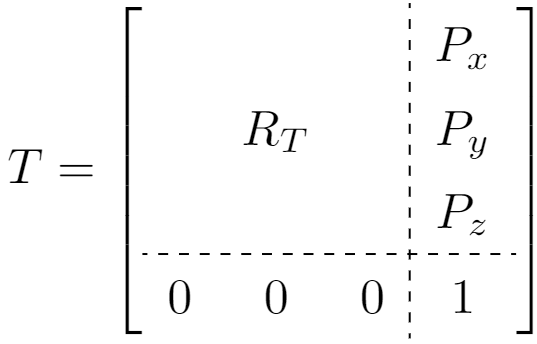

`R_T` is simply the composition of elementary rotations in x, y, and z by Euler's rotation theorem. The equations for the elementary rotations are coded below where `ROT_EE` is the same as `R_T` and the rotations are post-multiplied as extrinsic rotations since the `tf.transformations.euler_from_quaternion` function that will be used later takes arguments in an `sxyz` fashion.
```
    # define symbols for roll, pitch, yaw
    r, p, y = symbols('r p y')

    ROT_x = Matrix([[1,      0,       0 ],
                    [0, cos(r), -sin(r) ],
                    [0, sin(r), cos(r)  ]])

    ROT_y = Matrix([[ cos(p), 0, sin(p)],
                    [      0, 1,     0 ],
                    [-sin(p), 0, cos(p)]])

    ROT_z = Matrix([[ cos(y), -sin(y), 0],
                    [ sin(y),  cos(y), 0],
                    [      0,       0, 1]])

    # create composition of rotations extrinsic
    # R_xyz = ROT_z (yaw) * ROT_y (pitch) * ROT_x (roll)
    ROT_EE  = ROT_z * ROT_y * ROT_x
```
This rotation matrix can be written symbolically as follows:
```
⎡cos(p)⋅cos(y)  sin(p)⋅sin(r)⋅cos(y) - sin(y)⋅cos(r)  sin(p)⋅cos(r)⋅cos(y) + sin(r)⋅sin(y)⎤
⎢                                                                                         ⎥
⎢sin(y)⋅cos(p)  sin(p)⋅sin(r)⋅sin(y) + cos(r)⋅cos(y)  sin(p)⋅sin(y)⋅cos(r) - sin(r)⋅cos(y)⎥
⎢                                                                                         ⎥
⎣   -sin(p)                sin(r)⋅cos(p)                         cos(p)⋅cos(r)            ⎦
```

___
Decouple Inverse Kinematics problem into Inverse Position Kinematics and inverse Orientation Kinematics; doing so derive the equations to calculate all individual joint angles.

Based on the geometric Inverse Kinematics method described here, breakdown the IK problem into Position and Orientation problems. Derive the equations for individual joint angles. Your writeup must contain details about the steps you took to arrive at those equations. Add figures where necessary. If any given joint has multiple solutions, select the best solution and provide explanation about your choice (Hint: Observe the active robot workspace in this project and the fact that some joints have physical limits).
___
Now to work on the IK problem, one can use the generalized homogeneous transform from base link to gripper link and then find the joint angles that give the end effector position. First, however, a correction needs to be applied to account for the difference in the gripper link frame. 
```
# account for difference in orientation of gripper link frame
# first rotate about z-axis by 180 then y-axis by -90
ROT_ERROR = ROT_z.subs(y, radians(180)) * ROT_y.subs(p, radians(-90))

# get compensated rotation matrix
ROT_EE = ROT_EE * ROT_ERROR
```

One can then get `roll`, `pitch`, and `yaw` using the `tf.transformations.euler_from_quaternion` function and then substitute these values in to get the rotation matrix for the end-effector:
```
# get roll, pitch, and yaw using transformations module
(roll, pitch, yaw) = tf.transformations.euler_from_quaternion(
  [req.poses[x].orientation.x, req.poses[x].orientation.y,
   req.poses[x].orientation.z, req.poses[x].orientation.w])

ROT_EE = ROT_EE.subs({'r': roll, 'p': pitch, 'y': yaw})
```

For the **IK Position** part, the goal is to find theta1-3 which are the joint angles for the first three joints that determine the position of joint 5, the wrist center. One can start with the complete homogeneous transform from above:

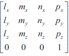

where l, m and n are orthonormal vectors representing the end-effector orientation along X, Y, Z axes of the local coordinate frame. n is the vector along the z-axis of the gripper_link.

The following equations describes the position of the wrist center. Since we are given the EE position by `p_x`, `p_y`, and `p_z`, this is simply a translation along `z` by `d_6` plus the length of the end effector `l`. 

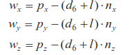

We have n_x, n_y, and n_z from our rotation matrix so we can solve for the wrist center position.

```
# position of wrist is just end effector translated back by d7
WC = EE - 0.303 * ROT_EE[:,2]
```

Solving for theta1 involves taking arctan of WC_y and WC_x.


In the code, this is represented as:

`theta1 = atan2(WC[1],WC[0])`

Next to find theta2 and theta3, the following diagram proves useful.

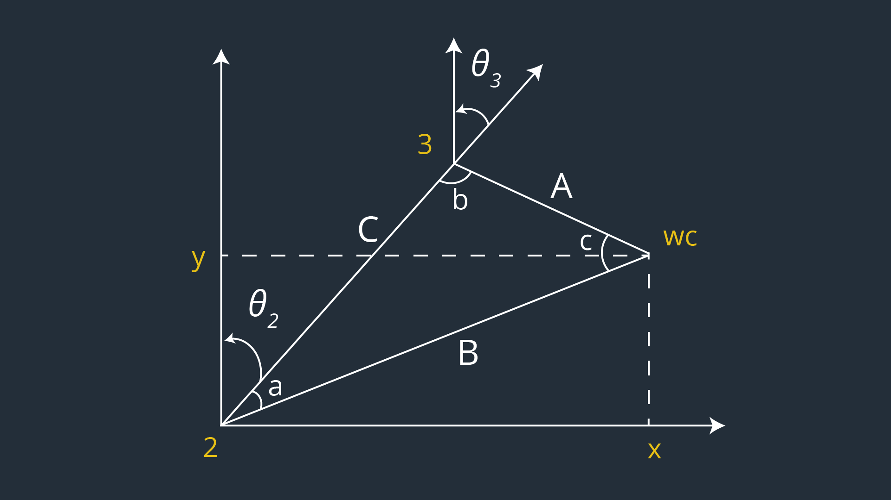

Side C of the triangle is the link length, `a2 = 1.25`, from above. 

Side A of the triangle can be calculated with Pythagorean's theorem knowing `d4 = 1.5` and `a3 = -0.054` where `sqrt(1.5^2+0.054^2) = 1.501`. 

Side B of the triangle can be calculated with Pythagorean's theorem in 3 dimensions. First, the base is calculated as `sqrt(WC[0] * WC[0] + WC[1] * WC[1]) - 0.35` where `0.35` is the link length `a1`. Second the height is calculated as `WC[2] - 0.75` where `0.75` is the link offset `d1`. Side B is then given by `sqrt(pow((sqrt(WC[0] * WC[0] + WC[1] * WC[1]) - 0.35), 2) + pow((WC[2] - 0.75), 2))`.

Given sides A, B, and C, the Cosine Laws can be used to calculate the angles opposite these sides (pulled from Wikipedia). 

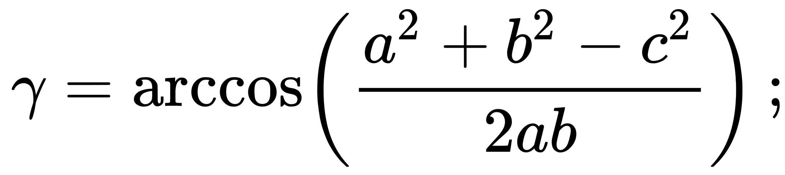
where `gamma` is the angle opposite side C.

Thus angles A, B, and C are given as follows by the Cosine Law:

```
angle_a = acos((side_b * side_b + side_c * side_c - side_a * side_a) / (2 * side_b * side_c))
angle_b = acos((side_a * side_a + side_c * side_c - side_b * side_b) / (2 * side_a * side_c))
angle_c = acos((side_a * side_a + side_b * side_b - side_c * side_c) / (2 * side_a * side_b))
```

Finally, given angles A, B, and C, theta2 and theta3 can be calculated using the diagram. 

`theta2 = pi/2 - angle_a - atan2(WC[2] - 0.75, sqrt(WC[0] * WC[0] + WC[1] * WC[1]) - 0.35)` with the last term being pulled from the same base and height used to calculate side B.

`theta3 = pi / 2 - (angle_b + 0.036)` where `0.036` is the angle that accounts for a3, the small drop in link 4.

For the **IK Orientation**, we start by examining `R3_6` written out symbolically which can be calculated using the individual transformation matrices from above:
```
⎡-sin(q₄)⋅sin(q₆) + cos(q₄)⋅cos(q₅)⋅cos(q₆)  -sin(q₄)⋅cos(q₆) - sin(q₆)⋅cos(q₄)⋅cos(q₅)  -sin(q₅)⋅cos(q₄)⎤
⎢                                                                                                        ⎥
⎢             sin(q₅)⋅cos(q₆)                             -sin(q₅)⋅sin(q₆)                   cos(q₅)     ⎥
⎢                                                                                                        ⎥
⎣-sin(q₄)⋅cos(q₅)⋅cos(q₆) - sin(q₆)⋅cos(q₄)  sin(q₄)⋅sin(q₆)⋅cos(q₅) - cos(q₄)⋅cos(q₆)   sin(q₄)⋅sin(q₅) ⎦
```
The elements of `R3_6` can be labelled:
```
r12, r13 = R3_6[0,1], R3_6[0,2]
r21, r22, r23 = R3_6[1,0], R3_6[1,1], R3_6[1,2] 
r32, r33 = R3_6[2,1], R3_6[2,2]
```
By rearranging terms to form the arctan with some basic trigonometric identities, one can find theta4-6. Note that theta 4 and 6 depend on the sign of theta 5.
```
theta5 = atan2(sqrt(r13**2 + r33**2), r23)

if sin(theta5) < 0:
   theta4  = atan2(-r33, r13)
   theta6 = atan2(r22, -r21)
else:
   theta4 = atan2(r33, -r13)
   theta6 = atan2(-r22, r21)
```
Given `ROT_EE` from our previous equation, one can then calculate `R3_6` numerically using the inverse of `R0_3`. Since `R0_3` is an orthogonal matrix its inverse is the same as its transpose and for quicker calculations, one can use `R0_3.transpose()` over `R0_3.inv("LU")`:
```
R3_6 = R0_3.transpose() * ROT_EE
```
These values can then be fed into the theta4-6 equations above.
___
# Project Implementation

Fill in the `IK_server.py` file with properly commented python code for calculating Inverse Kinematics based on previously performed Kinematic Analysis. Your code must guide the robot to successfully complete 8/10 pick and place cycles.

`IK_server.py` must contain properly commented code. The robot must track the planned trajectory and successfully complete pick and place operation. Your writeup must include explanation for the code and a discussion on the results.
___

For the `IK_server.py` file the previous FK code unnecessary for IK was commented out (e.g. calculating individual transforms between joints not used in calculating the joint angles). Additionally, matrices used repeatedly for each pose such as the rotation matrix were put outside of the "pose loop" and stored symbolically so they could be reused.

Running `rosrun kuka_arm IK_server.py` and `./safe_spawner.sh`, the robot was successfully able to complete 10/10 pick and place cycles!!! Doing the `R0_3.transpose()`` instead of `R0_3.inv("LU")` helped a lot with the time it took to calculate the inverse kinematics. 

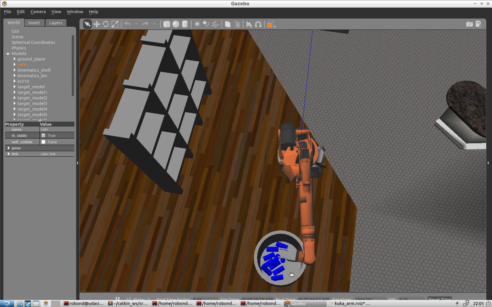

In running `IK_debug.py` on a few test cases, I found the error to very low. E.g. one test case is shown below.
```
Wrist error for x position is: 0.00000046
Wrist error for y position is: 0.00000032
Wrist error for z position is: 0.00000545
Overall wrist offset is: 0.00000548 units

Theta 1 error is: 0.00093770
Theta 2 error is: 0.00181024
Theta 3 error is: 0.00205031
Theta 4 error is: 0.00172067
Theta 5 error is: 0.00197873
Theta 6 error is: 0.00251871
```